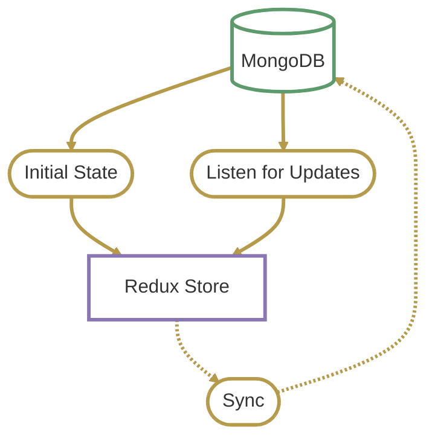

```mermaid
flowchart TB
    MongoDB[(MongoDB)]
    ReduxStore[Redux Store]
    InitialState([Initial State])
    ListenForUpdates([Listen for Updates])
    Sync([Sync])

    MongoDB ==> InitialState ==> ReduxStore
    MongoDB ==> ListenForUpdates ==> ReduxStore
    ReduxStore -.-> Sync -.-> MongoDB

    classDef database fill:none,stroke:#5D9B6D,stroke-width:3px
    classDef stateStore fill:none,stroke:#8A76B4,stroke-width:3px
    classDef gold fill:none,stroke:#B59A4A,stroke-width:3px

    class MongoDB database
    class ReduxStore stateStore
    class InitialState,ListenForUpdates,Sync gold

    linkStyle 0,1 stroke:#B59A4A,stroke-width:3px
    linkStyle 2,3 stroke:#B59A4A,stroke-width:3px
    linkStyle 4,5 stroke:#B59A4A,stroke-width:3px
```
