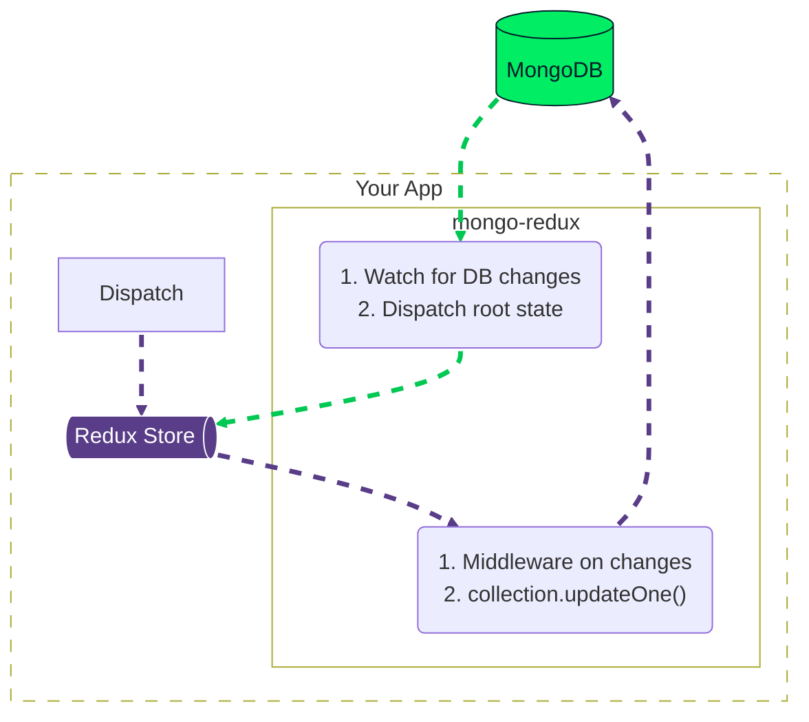

## Mongo-Redux syncer

### Idea

```mermaid
sequenceDiagram
    participant MongoDB@{ "type": "database" }
    participant Reducer
    participant ReduxStore as Redux Store

    MongoDB->>Reducer: initial state
    Reducer->>ReduxStore: create store
 
    ReduxStore<<->>MongoDB: "<br />"
    Note over ReduxStore,MongoDB: 🔄 Sync
```

### Data Flow

```mermaid
flowchart TB
  linkStyle default stroke-dasharray: 9,5,stroke-dashoffset: 900,animation: dash 25s linear infinite;

  DB@{ shape: database, label: MongoDB }
  style DB fill:#00ed64,color:#001e2b,stroke:#001e2b

  subgraph YOUR-APP["Your App"]
    style YOUR-APP fill:none,stroke-dasharray: 9,5
  
    STORE@{ shape: das, label: Redux Store }
    style STORE fill:#593d88,color:#fff,stroke:#fff
    
    OUTER-DISPATCH[Dispatch]
    
    subgraph LIBRARY["mongo-redux"]
      style LIBRARY fill:none
    
      INCOMING@{ shape: rounded, label: "1. Watch for DB changes<br>2. Dispatch root state" }
      MIDDLEWARE@{ shape: rounded, label: "1. Middleware on changes<br>2. collection.updateOne()" }
    end
  end
  
  OUTER-DISPATCH ==> STORE ==> MIDDLEWARE ==> DB
  DB ==> INCOMING ==> STORE

  linkStyle 0 stroke:#593d88
  linkStyle 1 stroke:#593d88
  linkStyle 2 stroke:#593d88
  linkStyle 3 stroke:#00C853
  linkStyle 4 stroke:#00C853
```
