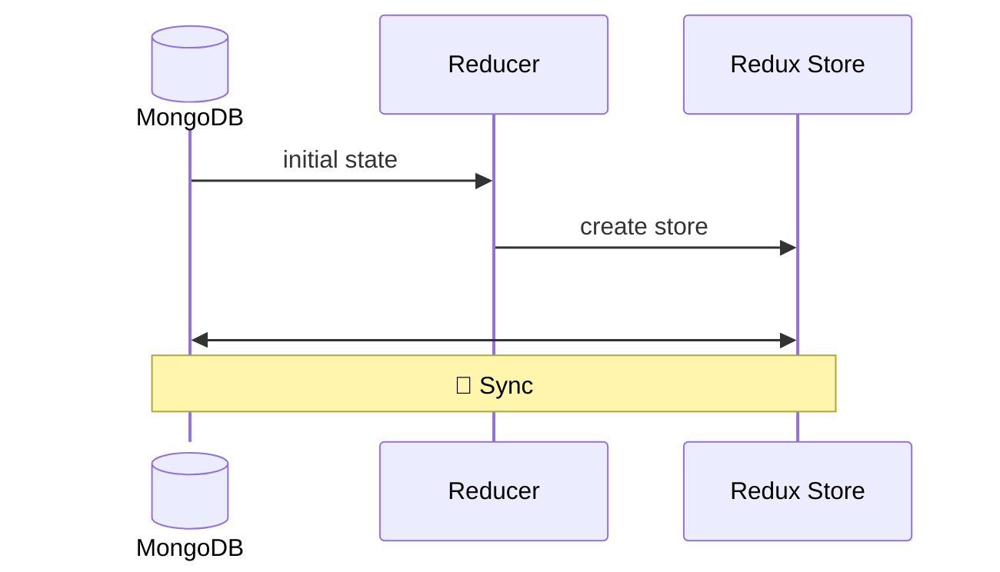

```mermaid
%%{init: {
  "sequence": {
    "messageMargin": 100
  }
}}%%

sequenceDiagram
    participant MongoDB@{ "type": "database" }
    participant Reducer
    participant ReduxStore as Redux Store

    MongoDB->>Reducer: initial state
    Reducer->>ReduxStore: create store
 
    ReduxStore<<->>MongoDB: <br />
    Note over ReduxStore,MongoDB: 🔄 Sync
```
